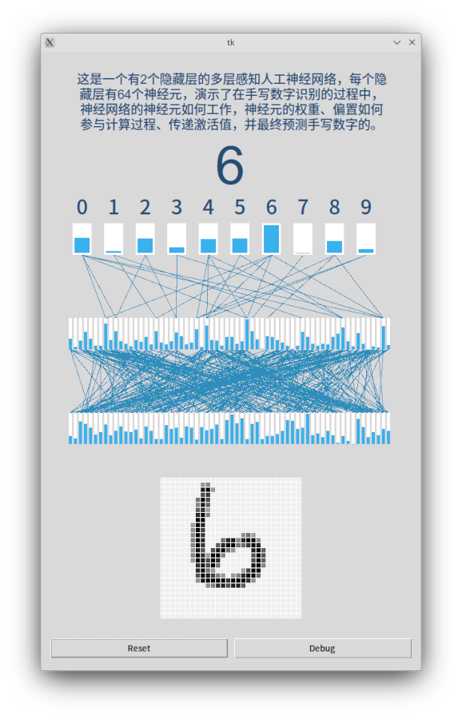

# handwritingdigit

English

## 1 Introduction
A handwritten digit recognition neural network visual demonstration program, including model training code, code for the visual interface, and Jupyter notebook.



## 2 Dependence
* PyTorch https://pytorch.org/
* NumPy https://numpy.org/
* Jupyter https://jupyter.org/
* matplotlib https://matplotlib.org/

## 3 Before you start 
Install **pytorch**, **numpy** first. Please choose the appropriate installation method according to your own situation. For pytorch, please refer to https://pytorch.org/get-started/locally/ 

If you need to run or debug the notebook to train your own model, will also need to install **jupyter**, **matplotlib**.

or you can simply if you know what you are doing:
```
pip install numpy
pip install matplotlib
pip install jupyterlab
pip install torch torchvision torchaudio
```

## 4 File list

```
.
├── hwdigit.py                  # visualization demo program
├── load_model_predict.ipynb    # a notebook that loads the model and predicts the test dataset.
├── load_model_predict.pdf      # pdf version
├── model_predict.pth           # the model we trained
├── README.md                   # this file
├── Screenshot.png              # the user interface of demo
├── train_with_data.ipynb       # a notebook that train and save the network model
└── train_with_data.pdf         # pdf version
```

## 5 Start the demonstration
```
python hwdigit.py 
```


# Chinese 中文

## 1 介绍
这是一个手写数字识别的神经网络可视化演示程序，包含模型训练代码、和可视化界面的代码，以及 Jupyter 笔记。

## 2 依赖
* PyTorch https://pytorch.org/
* NumPy https://numpy.org/
* Jupyter https://jupyter.org/
* matplotlib https://matplotlib.org/

## 3 开始之前 
首先安装 **pytorch**， **numpy**，请根据自己的情况选择合适的安装方式。有关pytorch，请参阅https://pytorch.org/get-started/locally/
如果您需要运行或调试 jupyter 笔记重新训练自己的模型，您还需要安装 **jupyter**， **matplotlib**。

或者如果你知道你在做什么，你可以直接运行下面代码：
```
pip install numpy
pip install matplotlib
pip install jupyterlab
pip install torch torchvision torchaudio
```

## 4 文件列表

```
.
├── hwdigit.py                  # 可视化演示程序源码
├── load_model_predict.ipynb    # 训练模型和预测数据的 jupyter 笔记
├── load_model_predict.pdf      # 训练模型和预测数据笔记的 pdf 版本
├── model_predict.pth           # 预训练的模型
├── README.md                   # 本文件
├── Screenshot.png              # 软件界面截图
├── train_with_data.ipynb       # 载入模型查看参数的 jupyter 笔记
└── train_with_data.pdf         # 载入模型查看参数笔记的 pdf 版本
```

## 5 运行演示程序
```
python hwdigit.py 
```
